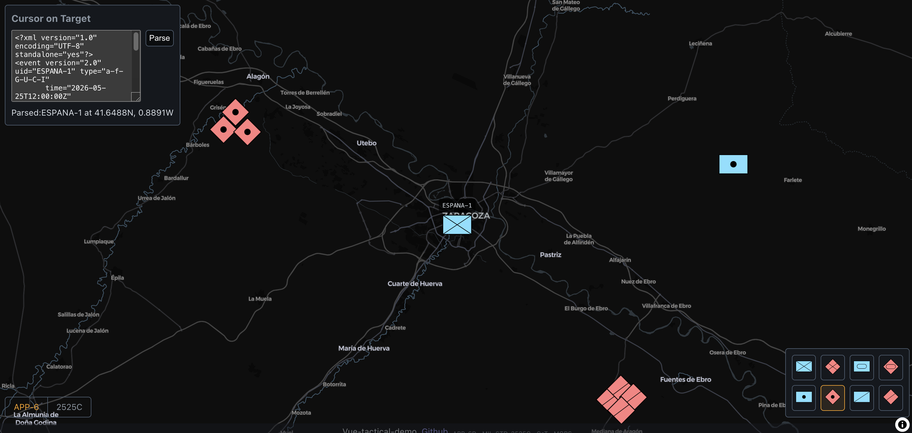

# vue-tactical-demo

A dark tactical map with NATO/US military symbology (APP-6D and MIL-STD-2525C), live MGRS coordinate readout, and Cursor-on-Target (CoT) XML parsing. Built as a weekend portfolio piece to show end-to-end frontend work against defense-domain standards.

[Live demo](#) (deployed to Cloudflare Pages — link coming soon) · [GitHub](https://github.com/belblue/vue-tactical-demo)



## What this is

A frontend operator workstation interface, scoped down to the essentials:

- A dark MapLibre-rendered map of Zaragoza, Spain.
- A symbol palette of eight units (friendly/hostile × infantry, armor, helicopter, SOF), rendered as APP-6D or MIL-STD-2525C symbols depending on the active standard.
- Click a palette button to "arm" a symbol, then click on the map to drop a marker there.
- A live MGRS readout under the cursor, with 5-digit precision.
- A CoT panel that takes pasted XML and drops a marker at the parsed coordinates, with the callsign label floating above it.

Both placement methods (click and CoT parse) write into the same shared store, so the map renders them uniformly. Toggling the standard re-renders palette and placed markers live, without reload.

## Why I built it

A small but complete vertical slice that exercises:

- A real domain (NATO/US military symbology) with vocabulary I had to learn rather than fake.
- Real third-party data formats (CoT XML, SIDC codes, MGRS grid references) parsed and rendered correctly.
- The Vue 3.5 modern API surface — composables, `useTemplateRef`, reactive watchers with `onWatcherCleanup`, the flat module-level state-sharing pattern.

Scope was deliberately tight (~16–20 hours), which forced honest decisions about what to build vs. what to leave for the README.

## Standards used

- **APP-6D** — NATO Joint Military Symbology (current). Defines frame shapes by affiliation (rectangle/diamond/circle/clover for friendly/hostile/neutral/unknown), inner icons by function, color rules.
- **MIL-STD-2525C** — US DoD military symbology. Largely harmonized with APP-6 for common ground/air units; diverges on specialized symbology (cyber, space, multinational variants).
- **CoT (Cursor-on-Target)** — DoD XML interchange format for sharing tactical entity state between systems. Used by ATAK, WinTAK, FreeTAKServer, etc. A CoT event encodes a UID, type (mapped to a SIDC), position, time/stale, and detail attributes like callsign.
- **MGRS (Military Grid Reference System)** — Alphanumeric grid coordinate system. Faster to call out over radio than decimal lat/lng (e.g., `30TXM 12345 67890` vs. `41.64880°N, 0.88910°W`).

## Stack

- **Vue 3.5** — composition API throughout. Modern macros (`useTemplateRef`, `defineModel`, `onWatcherCleanup`); no Options API, no legacy `defineComponent` runtime helper.
- **TypeScript (strict)** — strict mode, no `any` in committed code, discriminated unions for parse results.
- **Vite + SCSS** — fast HMR. SCSS with CSS custom-property tokens (`var(--accent)`, etc.) so theming stays reactive at runtime and works with Vue's `v-bind` in styles.
- **MapLibre GL** — open-source WebGL map renderer; no API key needed (Carto dark-matter free style).
- **milsymbol 3.0.4** — generates 2525/APP-6 SVG symbols from SIDC codes.
- **mgrs 2.1.0** — lat/lng to MGRS string conversion.
- **Vitest + jsdom** — unit testing, ~20 tests covering pure logic.

## Architecture

- **Module-level composables** as the state-sharing primitive. `useStandard`, `usePlacedSymbols`, `useMap`, `useMgrs`, `useCot` — each owns a small slice of state, consumers destructure what they need. No Pinia or Vuex; overkill at this scale and Vue 3's composable pattern is enough.
- **Single source of truth** for placed symbols: `usePlacedSymbols.placed` is the reactive array, TacticalMap watches it and renders markers via MapLibre. Both click-to-place and CoT-parse write through the same `add()` action.
- **Boundary translation** at the milsymbol API: the app's vocabulary is `'APP6' | '2525C'` (matching button labels and footer text), milsymbol's API is `'APP6' | '2525'`. The one-character difference is translated at the milsymbol call site only — the rest of the codebase stays in app vocabulary.
- **Cleanup discipline**: TacticalMap's `onBeforeUnmount` runs in a specific order: remove markers → `setMap(null)` (lets `useMgrs`'s watcher unsubscribe from mousemove) → `map.remove()` (destroys the WebGL context). Reversing this order leaks WebGL contexts on every HMR cycle.
- **`shallowRef` for class instances** — the MapLibre `Map` instance is held in a `shallowRef` because deeply reactive-wrapping its 120+ internal properties is both pointless (Vue doesn't render it) and breaks some of its method-binding internals.

## Running locally

```bash
npm install
npm run dev        # http://localhost:5173
npm run build      # vue-tsc -b && vite build
npm run test       # Vitest
```

## Testing

Vitest with jsdom for DOM-touching code. ~20 tests, covering pure logic only:

- `cot-to-sidc.test.ts` — every affiliation letter, ground infantry/armor, fallback, malformed CoT type strings.
- `cot-parse.test.ts` — happy path, missing callsign, malformed XML, missing event/uid/type/point, invalid lat/lon.
- `mgrs-format.test.ts` — happy path, 1-digit grid zones, no-match passthrough.
- `useStandard.test.ts` — default state, mutations, shared-singleton property.
- `usePlacedSymbols.test.ts` — arm toggle, add behavior, id uniqueness, shared-singleton property.
- `useCot.test.ts` — success and failure round-trip through the reactive wrapper.

No E2E, no component snapshot tests, no Vue Test Utils — deliberately out of scope for a weekend build. Pure functions and composables are where the leverage is.

## Scope

**In scope**
- Click-to-place palette with arm/disarm
- Live MGRS readout (hides when cursor leaves map)
- CoT XML parsing → marker drop with callsign label
- APP-6D ↔ 2525C toggle that re-renders palette and placed markers live
- Friendly error messages for malformed XML

**Out of scope**
- Backend / persistence — frontend integration only
- Real-time CoT stream (websocket / file watcher) — XML pasted manually
- Touch / mobile — tested on desktop browsers; MGRS readout requires a pointer device
- Full 2525 symbol catalog — palette has 4 unit classes; CoT mapping covers ground infantry/armor with a fallback for everything else
- Tactical graphics (control measures, boundary lines, fire support coordination measures)
- Multi-map / map-switching / second basemap option

## License

MIT — see [LICENSE](LICENSE).
